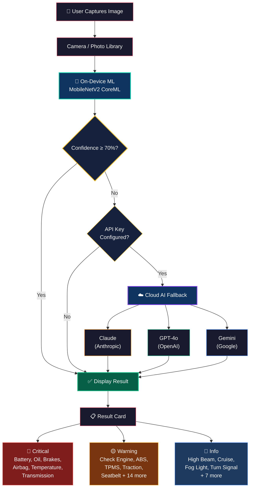

# 🚗 Dashboard Diagnostics

An iOS app that identifies car dashboard warning lights instantly using on-device machine learning. Point your camera at a dashboard symbol, and the app tells you what it means, how urgent it is, and what to do.

<p align="center">
  
</p>

## Demonstration
<p align="center">
  
</p>

## Features

- **On-device ML classification** using a custom-trained MobileNetV2 CoreML model (no internet required)
- **36 dashboard symbols** recognized across 3 urgency levels (Critical, Warning, Info)
- **Hybrid AI fallback** — when on-device confidence is below 70%, optionally send to Claude, GPT-4o, or Gemini for a second opinion
- **Camera + Photo Library** input support
- **Detailed explanations** — each symbol includes what it means, urgency level, and recommended action
- **Dark mode** interface with animated splash screen

## Architecture



## Supported Warning Lights

| Critical (🔴) | Warning (🟡) | Info (🔵) |
|---|---|---|
| Battery / Charging | Check Engine | Washer Fluid Low |
| Oil Pressure | ABS | High Beam |
| Engine Temperature | Seatbelt | Low Beam |
| Brake System | Tire Pressure (TPMS) | Turn Signal |
| Airbag / SRS | Low Fuel | Fog Light |
| Transmission | Door Ajar | Cruise Control |
| | Traction Control | Adaptive Cruise |
| | Power Steering | Auto Headlights |
| | Parking Brake | Auto Start-Stop |
| | Electronic Stability | Hill Start Assist |
| | Master Warning | Rear Fog Light |
| | Key / Immobilizer | |
| | Hood / Trunk Open | |
| | Service / Maintenance | |
| | DPF Warning | |
| | Glow Plug | |
| | Lane Departure | |
| | Blind Spot Monitor | |
| | Frost Warning | |

## Requirements

- iOS 16.0+
- Xcode 15.0+
- Swift 5.0+
- Physical device recommended (camera access)

## Getting Started

1. Clone the repo:
   ```bash
   git clone https://github.com/yourusername/DashboardDiagnostics.git
   ```
2. Open `DashboardDiagnostics/DashboardDiagnostics.xcodeproj` in Xcode
3. Select your development team under Signing & Capabilities
4. Build and run on your device

## Architecture

```
DashboardDiagnostics/
├── DashboardDiagnosticsApp.swift   # App entry point
├── SplashView.swift                # Animated launch screen
├── ContentView.swift               # Home screen + Settings
├── CameraView.swift                # Camera capture interface
├── ClassifierService.swift         # ML classification + LLM fallback
├── ResultView.swift                # Results display
├── WarningLightInfo.swift          # Symbol database (36 entries)
├── DashboardClassifier.mlpackage   # CoreML model (MobileNetV2)
└── Assets.xcassets/                # App icon + assets
```

## How It Works

1. **Capture** — Take a photo or select from library
2. **Classify** — MobileNetV2 model runs on-device to identify the symbol
3. **Fallback** — If confidence < 70% and an API key is configured, the image is sent to your chosen LLM provider for vision-based identification
4. **Display** — Results show the symbol name, urgency level, description, and recommended action

## Cloud AI Fallback (Optional)

The app works fully offline with the on-device model. For improved accuracy on edge cases, you can optionally configure a cloud AI provider in Settings:

- **Claude (Anthropic)** — `sk-ant-...`
- **GPT-4o (OpenAI)** — `sk-...`
- **Gemini (Google)** — Google AI API key

API keys are stored locally on-device only.

## Copyright

© 2025 Rijul Chaturvedi. All rights reserved.

This repository has no open-source license. You may view the source code, but you may not copy, modify, distribute, or use it in any project without explicit written permission.

## Author

Designed & Developed by **Rijul Chaturvedi**

